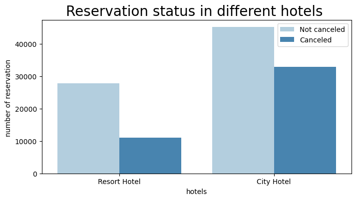
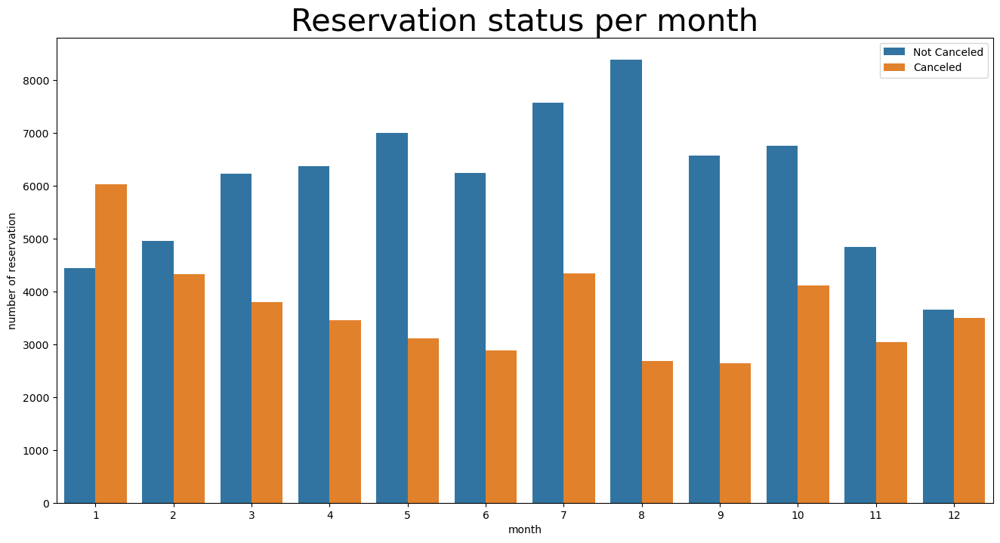
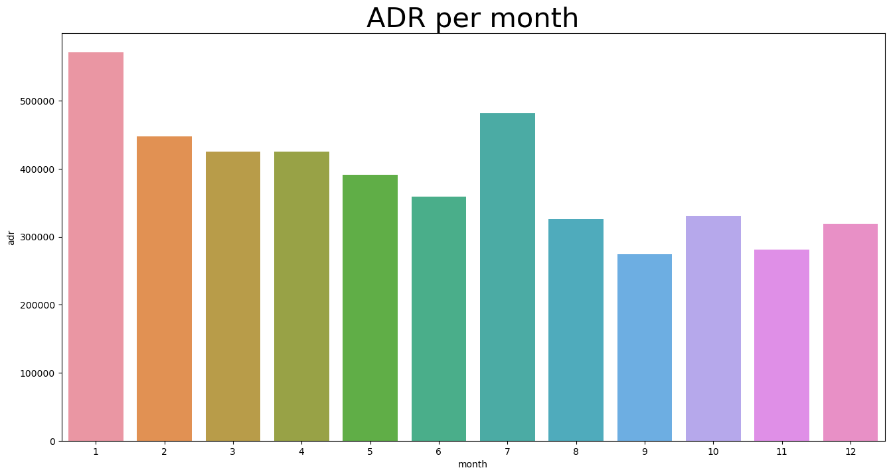
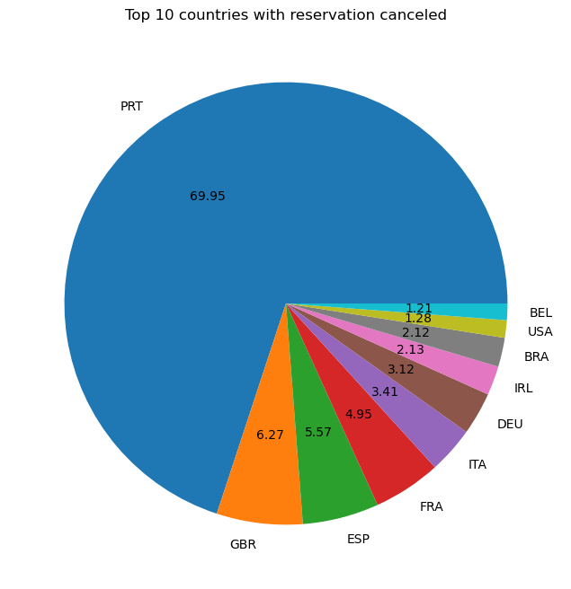

# Hotel Booking Data Analysis Using Python.

# Overview
The "Hotel Booking Data Analysis" project is a Pyhton-Based data analysis endeavor aimed at exploring and understanding  Hotel Booking data from Kaggle.
The Project employs various Python Libraries, including Pandas, Matplotlib, NumPy and Seaborn to analyze and visualise dataset. 
The Dataset contains 119390 entries with 32 columns. 

# Business Problem 

In recent years, City Hotels and Resort have been high cancellation rates. Each hotel is now dealing with a number of issues as a result, including fewer revenues and less than ideal hotel room use. Consequently, lowering cancellation rates in both hotels primary goal in order to increase their effifciency inn generating revenue and for us to offer thorough business advice to address this problem 

### Research Question 
* what are the variables that affect hotel reservation cancellations? 

* How can we make hotel reservation cancellations better? 

* How eill hotels be assisted in making pricing andpromotiondecisions? 

### Hypothesis 
* More cancellation occur when price higher are higher 
* when there is a longer waiting list, customers tend to cancel more frequenctly. 

# Analysis And Findings 

* The bar graph shows the percentage of reservation the are cancelled and those that are not. There are 37% of clients who cancelled their reservation, which has a significant impact on the hotel's earnings. 

-----------------------------

* In comparison to resort hotels, city hotels have more bookings. It's possible that resort hotels are more expensive than those city hotels.

---------------------------

*  We have developed the grouped bar graph to analyze the months with highest and lowest reservation levels according to reservation status. As can be seen, both the number of confirmed reservations and the numbers of canceled reservation are largest in the month of August, whereas January is the month with the most canceled reservation.

-----------------------
* And the below Bar graph shows that cancellation are the most when price are greatest and are the least common when they are lowest. so, the prices are the most common reason for the cancellation. 

---------------------------

* Top 10 countries with reservation cancelled. Portugal with the highest number of cancellations. 

----------------------

* Around 46% of the clients come from online travel agencies, whereas 27% are coming from Direct or Groups.
only 4% of clients book hotels directly by visiting them and making reservation. 
----------------------------

* As seen in the graph, reservation are canceled when the average daily rate is higher than when it is not canceled. 
It clearly proves that all above analysis, that the higher price leads to higher cancellation . 

